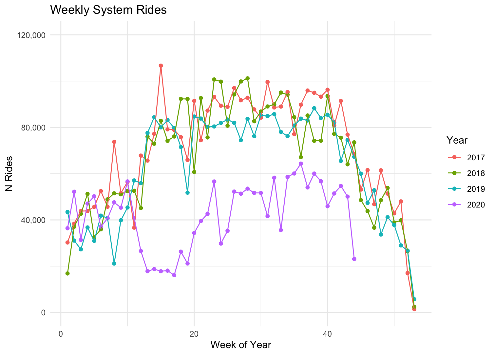
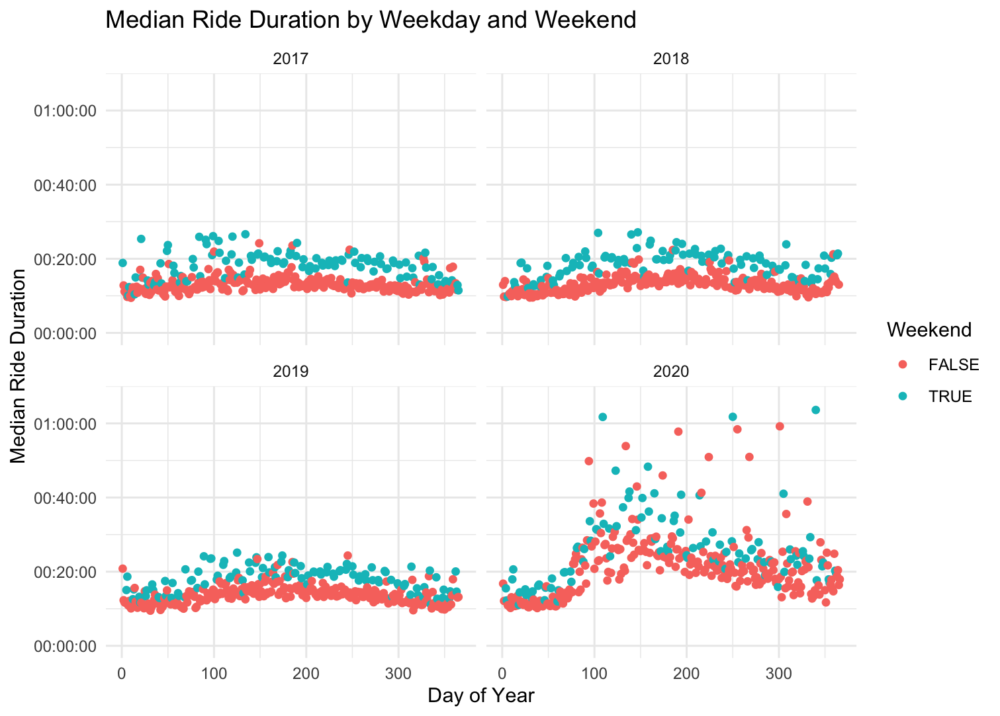
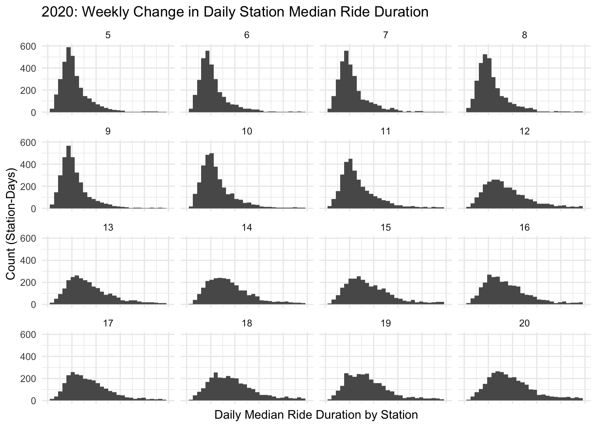
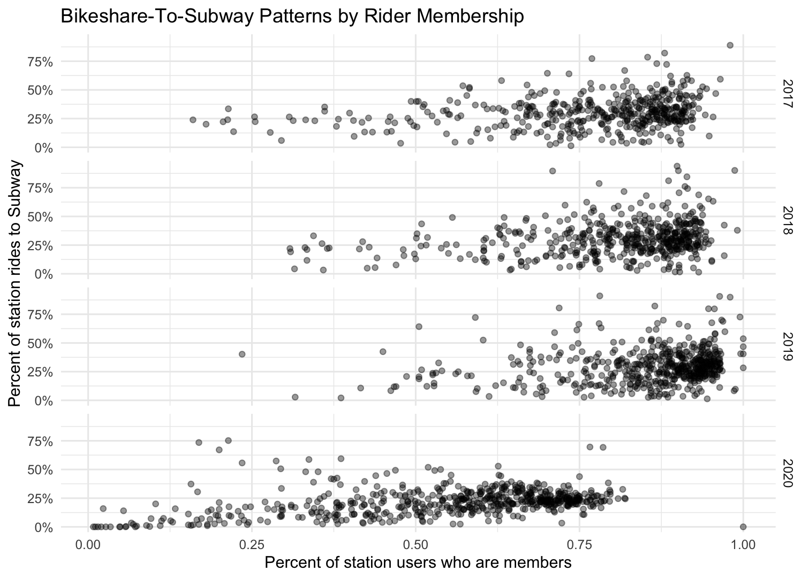

# Bikeshare

A work-in-progress project to analyze Capital Bikeshare data. My research angle looks at any potential changes in aggregate usage patterns due to COVID-19. This is an independent research project; my views and conclusions here are my own.

## Data
Please note that while the code here is available publicly, all system data should be downloaded directly from the capital bikeshare [website](https://www.capitalbikeshare.com/system-data), as per their [license agreement](https://www.capitalbikeshare.com/data-license-agreement). The full usage data is quite large (~4gb), so please make the appropriate adjustments or time allotments when running the code.

The code is designed to pull the raw .csv files from folders named by year. 

## Interesting Findings so far...

### System Rides By Week
In pre-pandemic years, the late spring, summer, and early fall weeks see the highest monthly rides. In 2020, the first few weeks had weekly ride tallys in line with pre-pandemic years, but April of 2020 saw a drastic decrease in the number of rides compared to pre-pandemic years. Monthly rides stayed below pre-pandemic years, but nevertheless recovered after the spring dip in ridership.

### Ride Duration by Weekday and Weekend
Median ride durations appear higher on the weekends throughout the year. But at the start of the pandemic we begin to see a pattern where median ride durations are longer -- on both weekdays and weekends.

### Variation in Median Duration
The changes in median duration from each station play out between the 10th and 12th weeks of 2020, where the distribution of ride lengths becomes more spread out quite quickly.

### Percent of rides going to a Bikeshare station near a subway station
In 2020, we also see a more accentuated relationship between membership and metro-going percentages: the higher proportion of users that check out a bike that are members, the more likely the ride patterns from that station are headed to a another station near a metro.

## Current Status and Research Questions
__note: main project currently on pause due to development of [cycleR](https://github.com/buscandoaverroes/cycleR), which should hopefully make this project better :)__ 

_Technical_
1. Should the project architecture+code be tweaked to fit the `stplanr` [package and workflow](https://github.com/ropensci/stplanr)?
2. How to treat docked vs dockless bikes?

_Research_
1. What indicators are most useful for tracking aggregate trends before and across different stages of the pandemic?
2. Can the GINI coefficient be implemented to reveal anything, and if so what does it actually mean?
3. Can we really think about trends in a pre-, during-, return-to-normal trajectory or is this "restoration" narrative less appropriate than a "change" narrative?

## Attribution

Data come from OpenStreetMap and from CapitalBikeShare (as described above). Upon the request of OSM, here's the attribution:  "© OpenStreetMap contributors". The data derived from OpenStreetMap should be maintained under the [Open Database License](www.opendatacommons.org/licenses/odbl); I intend to do so. 
